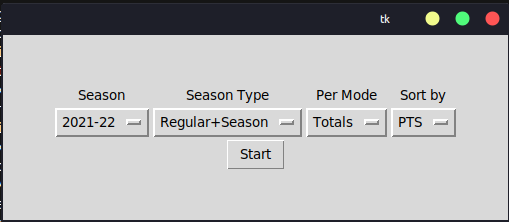

## **NBA Stats Web Scraper**
This is a Python script that scrapes NBA player stats from the official NBA website using Selenium and saves the data to a CSV file. The user can select various parameters for the data to be scraped such as season, season type, per mode, and sort type using the Graphical User Interface (GUI) built with Tkinter.

## **Usage**
  

To use the NBA Stats Web Scraper:  
1. Open a terminal and navigate to the directory where the script is saved.  
2. Run the script 
3. Select the desired options for the data to be scraped using the dropdown menus on the GUI.  
4. Click on the "Start" button to begin the scraping process.  
5. Wait for the process to complete. A message box will appear once the data has been successfully saved to a CSV file.  

> The scraped data will be saved to a CSV file with a filename that includes the selected options for season, season type, per mode, and sort type.

## **Note**
This script is specific to the NBA website structure at the time of writing (August 2022) and may require modifications in the future if the website structure changes. Additionally, the script can be adapted to scrape other data from the NBA website, such as team stats, advanced stats, etc.